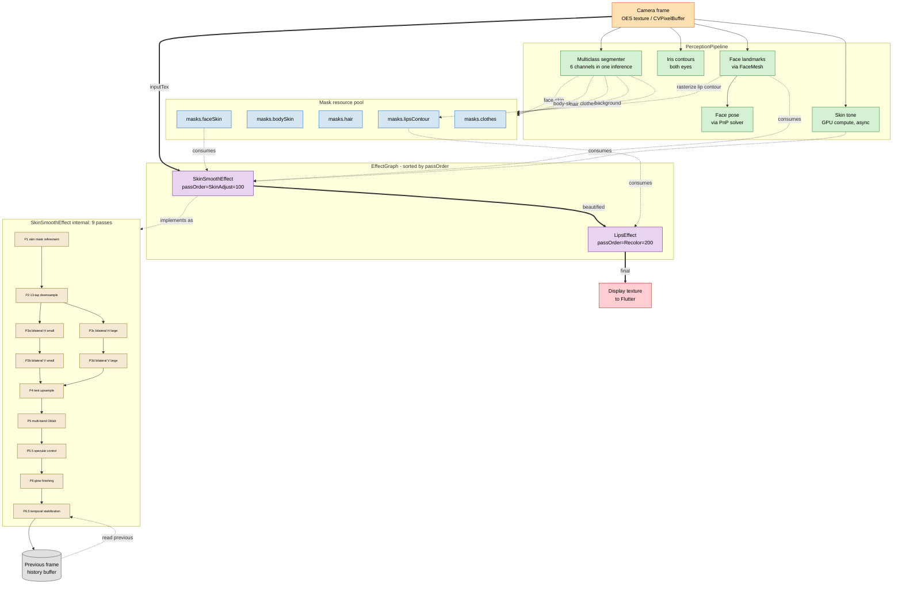
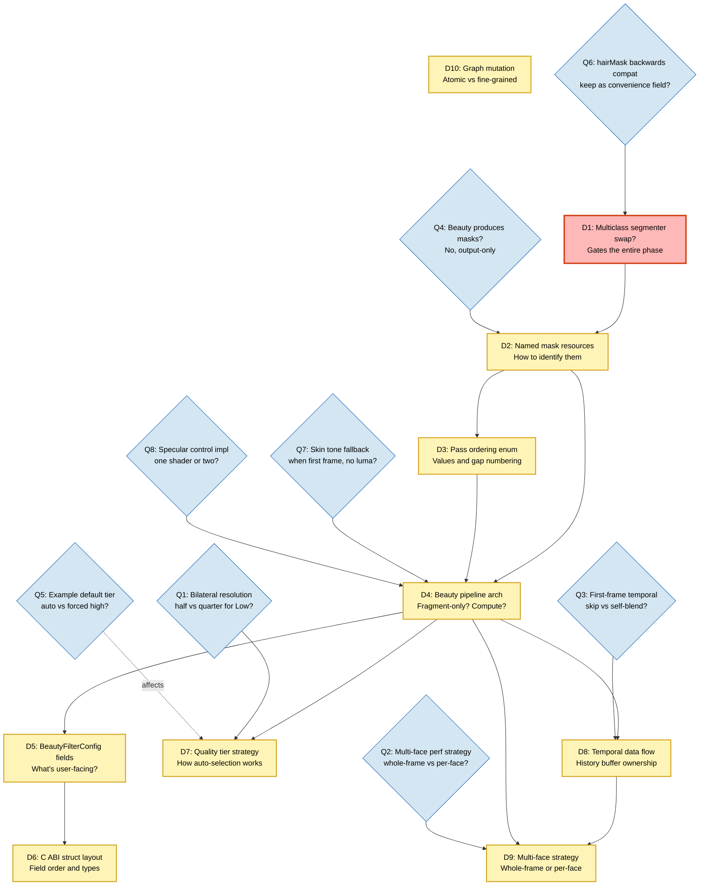

# Phase 3 — Dependency graphs

Three different DAG views of Phase 3, each answering a different question:

| View | Question it answers | Best for |
|---|---|---|
| Implementation DAG | What work do I do in what order? | Sprint planning |
| Runtime DAG | How does data flow at frame time? | Architecture reasoning |
| Decision DAG | What decisions block what other decisions? | Sequencing the design work |

Each DAG uses Mermaid syntax that renders natively in GitHub markdown. Copy any diagram into a Mermaid Live editor for interactive exploration.

---

## 1. Implementation DAG

Maps the discrete work units required to ship Phase 3 and their dependencies. Use this to plan your work sequence and identify what can be parallelized.

### Diagram

```mermaid
graph TD
    %% ============ MODEL / PERCEPTION LAYER ============
    M1[M1: Add multiclass model URL<br/>to fetch_models.sh]
    M2[M2: Implement MulticlassSegmenter<br/>C++ wrapper]
    M3[M3: Update PerceptionPipeline<br/>to expose 6 channels]
    M4[M4: Add new mask fields<br/>to PerceptionFrame]
    M5[M5: Curate diverse test<br/>image set]
    M6[M6: Benchmark multiclass<br/>quality on test set]
    M7{M7: Commit to swap?<br/>Yes / Revert to old}

    M1 --> M2 --> M3 --> M4
    M5 --> M6
    M2 --> M6
    M6 --> M7

    %% ============ EFFECT GRAPH LAYER ============
    G1[G1: Add MaskRequirements<br/>to Effect interface]
    G2[G2: Add passOrder enum<br/>to Effect interface]
    G3[G3: Implement<br/>MaskResourcePool]
    G4[G4: EffectGraph sorts<br/>by passOrder]
    G5[G5: EffectGraph wires<br/>mask pool to effects]
    G6[G6: EffectGraph dedupes<br/>mask production]
    G7[G7: Update Phase 2 effects<br/>declare consume requirements]

    G1 --> G3
    G2 --> G4
    G3 --> G5
    G4 --> G5
    G5 --> G6
    G1 --> G7
    G2 --> G7

    %% ============ BEAUTY V2 LAYER ============
    B1[B1: Design SkinSmoothEffect<br/>public API]
    B2[B2: BeautyFilterConfig<br/>Dart class + validate]
    B3[B3: CARBeautyFilterConfig<br/>C struct]
    B4[B4: SkinSmoothEffect<br/>C++ scaffold]
    B5[B5: P1 skin mask<br/>refinement shader]
    B6[B6: P2 downsample shader]
    B7[B7: P3 bilateral shader<br/>both radii]
    B8[B8: P4 upsample shader]
    B9[B9: P5 multi-band<br/>Oklab composition]
    B10[B10: P5.5 specular<br/>control shader]
    B11[B11: P6 glow<br/>finishing shader]
    B12[B12: P6.5 temporal<br/>stabilization shader]
    B13[B13: Wire all passes<br/>in render]
    B14[B14: Temporal history<br/>buffer management]

    B1 --> B2
    B1 --> B3
    B1 --> B4
    G1 --> B4
    G2 --> B4
    M7 --> B5

    B4 --> B5
    B4 --> B6
    B4 --> B7
    B4 --> B8
    B4 --> B9
    B4 --> B10
    B4 --> B11
    B4 --> B12

    B5 --> B13
    B6 --> B13
    B7 --> B13
    B8 --> B13
    B9 --> B13
    B10 --> B13
    B11 --> B13
    B12 --> B13
    B12 --> B14
    B14 --> B13

    %% ============ QUALITY TIERS ============
    Q1[Q1: BeautyQuality enum]
    Q2[Q2: Startup benchmark<br/>for auto-tier]
    Q3[Q3: Adaptive throttling rule]
    Q4[Q4: Tune which passes<br/>skip per tier]

    Q1 --> B13
    B13 --> Q2
    Q2 --> Q3
    B13 --> Q4

    %% ============ PRESETS & INTEGRATION ============
    P1[P1: Define preset constants]
    I1[I1: Update example app<br/>with beauty controls]
    I2[I2: Add to public<br/>Dart exports]
    I3[I3: Register factory<br/>in C ABI]

    B2 --> P1
    B2 --> I2
    B13 --> I3
    P1 --> I1
    B13 --> I1

    %% ============ VERIFICATION ============
    V1[V1: Composition test<br/>beauty + lipstick]
    V2[V2: Diverse skin tones]
    V3[V3: Diverse hair textures]
    V4[V4: Perf on Snapdragon 7]
    V5[V5: Perf on iOS A12+]
    V6[V6: Memory / 5-min session]
    V7[V7: Multi-face stress]

    G6 --> V1
    B13 --> V1
    B13 --> V2
    M7 --> V2
    B13 --> V3
    M7 --> V3
    Q3 --> V4
    Q3 --> V5
    B14 --> V6
    V1 --> V7

    %% ============ STYLES ============
    classDef gate fill:#fff4b8,stroke:#d4a017,stroke-width:3px,color:#000
    classDef perception fill:#d4f1d4,stroke:#2e7d32,color:#000
    classDef graph fill:#d4e6f1,stroke:#1565c0,color:#000
    classDef beauty fill:#e8d4f1,stroke:#6a1b9a,color:#000
    classDef quality fill:#f1d4d4,stroke:#c62828,color:#000
    classDef verify fill:#f1e6d4,stroke:#5d4037,color:#000

    class M7 gate
    class M1,M2,M3,M4,M5,M6 perception
    class G1,G2,G3,G4,G5,G6,G7 graph
    class B1,B2,B3,B4,B5,B6,B7,B8,B9,B10,B11,B12,B13,B14 beauty
    class Q1,Q2,Q3,Q4 quality
    class V1,V2,V3,V4,V5,V6,V7 verify
```

### How to read it

- **Color coding:** green = perception, blue = effect graph, purple = beauty pipeline, red = quality tiers, brown = verification, yellow = decision gate.
- **M7 is the single decision gate.** Everything downstream of the multiclass model assumes the swap is committed. If M6 reveals the model is worse on diverse hair/skin (the documented risk), M7 reverts and the architecture changes. *Don't start B5 until M7 is settled.*
- **B5-B12 are independent shader implementations.** A solo developer can pick any order; a team could parallelize. Each is a self-contained piece of GLSL.
- **B13 (wiring) is a critical-path bottleneck.** It can't start until at least P1 (B5) is done, but it doesn't need *all* passes to start — it can be implemented incrementally as each shader lands.

### Critical path

The longest sequence — what limits the minimum project duration:

```
M5 (test set) → M6 (benchmark) → M7 (decision)
  → B5 (P1 shader)
  → B13 (wiring)
  → V2 / V3 (quality verification)
```

This is ~7 nodes deep. Each non-shader node is ~1-3 days of focused work; shaders are typically 2-5 days each depending on complexity (P5 multi-band composition is the hardest, ~1 week).

**Solo developer estimate:** 4-6 weeks of focused work for the critical path, with B6-B12 fitting into the wall-clock gaps left by B13 wiring iterations.

### Parallelizable work (no blocking dependencies on critical path)

- M5 (test set curation) can start day 1
- G1, G2 (interface additions) can start day 1
- B1, B2, B3 (API design) can start once G1, G2 are done — even before M7
- P1 (presets) can start once B2 is done
- Documentation can be written alongside any of the above

### What to do FIRST in week 1

If you're a solo dev with one week to "start Phase 3 productively," the highest-value work without waiting on anything:

1. **M5 — curate test image set.** Most time-consuming non-coding task. Block it out early so it's done by the time you need it.
2. **G1 + G2 — interface changes.** Cheap, unblocks everything else in graph and beauty.
3. **B1 — API design discussion.** Even before any code, sketch what `BeautyFilterConfig`'s constructor will look like.

### What NOT to do in week 1

- Start writing beauty shaders (B5-B12). They depend on M7 and on B4. Premature work here either gets thrown away (if M7 reverts) or has to be reworked (if the API changes).
- Set up quality tier auto-selection (Q2). Pointless until B13 works.
- Update the example app (I1). The thing you're showing off doesn't exist yet.

---

## 2. Runtime data-flow DAG

How a single frame moves through the pipeline at runtime, once Phase 3 is shipped. This is the architecture diagram, not the work plan.

### Diagram



### How to read it

- **Solid bold arrows (`==>`)** are the main pixel pipeline — input texture flowing through the effect chain.
- **Dotted arrows (`-.->`)** are auxiliary data dependencies (masks, landmarks, skin tone) — what each effect reads alongside the main input.
- **The PerceptionPipeline runs once per frame** and produces all the perception outputs in parallel internally.
- **The mask pool sits between perception and effects.** All face-derived masks live here briefly during the frame.
- **The temporal history buffer is the only persistent state** between frames. Everything else is rebuilt each frame.

### Frame-time budget overlay

Approximate timings on Snapdragon 7-class Android, High tier:

```
Camera input + GL setup:              1 ms
PerceptionPipeline (parallel):       16-22 ms
  FaceMesh:        8 ms
  Iris (both):     4 ms
  Multiclass:      10 ms
  Pose:            1 ms
  Skin tone:       (async, ~0 ms on render thread)
Mask production (lip contour):       0.5 ms
SkinSmoothEffect (9 passes):         7 ms
LipsEffect:                          1 ms
Display handoff:                     1 ms
─────────────────────────────────────────
Total per frame:                     ~27-32 ms
```

Tight at 30 fps. Medium tier shaves ~3 ms off SkinSmoothEffect. Plan for Medium being the most common real-world tier.

---

## 3. Architectural decision DAG

What design decisions block other design decisions. Use this to understand which open questions to resolve first, before any code is written.

### Diagram



### How to read it

- **D1 (red gate)** is the project-defining decision. If you commit to the multiclass swap, everything below proceeds; if you revert, the design pivots.
- **D2 → D3 → D4** is the architectural backbone — these three settle the shape of everything that follows.
- **Open questions (blue diamonds)** feed into the decisions they affect. Each open question must be resolved before the corresponding decision is locked.

### Recommended decision order

```
Day 1-3:   Resolve Q6 (hairMask compat) and Q1 (bilateral res) → lock D1
Day 4-5:   Lock D2 (mask resource naming) → D3 (pass enum)
Day 6-10:  Resolve Q3, Q7, Q8 → lock D4 (beauty arch)
Day 11-12: Lock D5 (config fields) → D6 (C ABI struct)
Day 13-14: Resolve Q1, Q5 → lock D7 (tiers)
Day 15:    Resolve Q2 → lock D9 (multi-face)
Day 16:    Lock D8 (temporal) and D10 (graph mutation)
```

Most decisions converge in 2-3 weeks of focused design work, well before any beauty shader code is written.

---

## How these three DAGs relate

- **Implementation DAG** is for the project manager scheduling work.
- **Runtime DAG** is for the engineer understanding the architecture at frame time.
- **Decision DAG** is for the architect sequencing design work before implementation starts.

If you're solo, you're playing all three roles, but they're separable cognitive activities:

1. **First, settle decisions** (Decision DAG order)
2. **Then, plan implementation** (Implementation DAG critical path)
3. **Throughout, reason about correctness against the runtime model** (Runtime DAG)

The DAGs are also useful for explaining the project to outside contributors who join mid-Phase. Showing someone the runtime DAG conveys 30 minutes of architecture in a single glance.

---

## Limitations of the DAG view

A DAG is not a complete project plan. It omits:

- **Effort estimates per node.** A node might be 4 hours or 4 weeks.
- **Resource conflicts.** One developer can't work on two parallel nodes simultaneously.
- **Risk-weighted paths.** B7 (bilateral shader) has higher implementation risk than B6 (downsample).
- **Iteration loops.** Real shader development involves write → test → tune cycles that the DAG hides.

For a more complete picture, pair this with a Gantt chart that adds duration and resource lanes. For Phase 3 specifically, that's likely overkill — the DAG plus the requirements doc covers what a solo developer needs.
